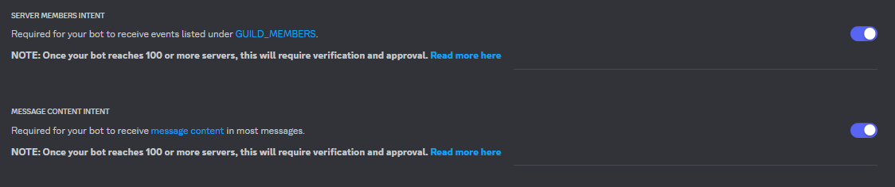
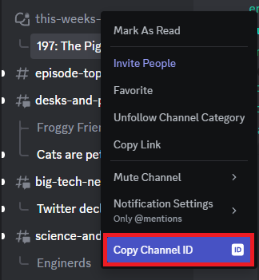
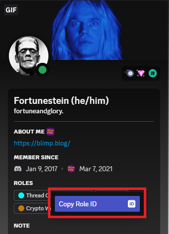

# Threadslapper

Monitors multiple RSS feeds for new episodes. If a new episode is posted it will download the thumbnail and create a new thread in a specified discord forum.

## Setting up bot

1. Create a new bot in <https://discord.com/developers/applications>
2. In the new bot's settings on the developer portal, go to the `Bot` tab, and get a token (click `Reset Token`), and save this to a file on your local machine.

3. In the new bot's `Oauth2` tab, click `URL Generator`, choose `Bot` within the `Scopes` section, and then select the following scopes in the `Bot Permissions` section that appears:
    - General Permissions
      - `Read Messages/View Channels`
    - Text Permissions
      - `Send Messages`
      - `Create Public Threads`
      - `Create Private Threads`
      - `Send Messages in Threads`
      - `Manage Threads`
      - `Embed Links`
      - `Attach Files`

4. Open the generated URL in a browser and add the bot to the desired server (ex: `Brad & Will Made a Tech Pod`).

- **NOTE:** You will need to enable the `Message Content Intent` in the `Bot` menu of <https://discord.com/developers/applications> for this bot to now function.

- **NOTE:** To enable automatically adding users to a newly created thread, you will need to enable the `Server Members Intent`in the `Bot` menu of <https://discord.com/developers/applications>.

 

## Setting up docker container

Create a `.env` file mapping to all variables defined in `docker-compose.yml`, then execute `docker compose up -d --build`.

An example would be:

```properties
THREADSLAPPER_TOKEN=BOT_TOKEN_FROM_DISCORD
THREADSLAPPER_CHECK_INTERVAL_MIN=5
THREADSLAPPER_STARTUP_LATEST_EPISODE_CHECK=true
THREADSLAPPER_CONFIG_FILE=config.yml
```

Additionally, and mostly for testing purposes, it may be handy to force all monitored RSS feeds to the same channel. To do so populate the following with the channel ID of your choice:

```properties
# override all channel_id's and announce_channel_id's configured per feed.
THREADSLAPPER_OVERRIDE_CHANNEL_ID=1234567890
THREADSLAPPER_OVERRIDE_ANNOUNCE_CHANNEL_ID=1234567890
```

As well as uncomment the relevant keys in the `docker-compose.yml` file.

## Setting a watch on an RSS Feed

### Note on `channel_id` variable

`channel_id` is used in the following sections and refers to copying the channel ID from discord.



If you do not see this menu option, you will need to enable Developer Mode in your discord client. This can be toggled in the settings within the `Advanced` section.

### Note on `subscriber_role_id` variable

`subscriber_role_id` is optionally used to add users belonging to a specific role to a thread and refers to copying the role ID from discord. For example it can be copied by right clicking on a role on a user's profile.



If you do not see this menu option, you will need to enable Developer Mode in your discord client. This can be toggled in the settings within the `Advanced` section.

### Single RSS feed

For a single RSS feed, you can specify the following environment variables in the docker-compose file and associated `.env`:

```yaml
THREADSLAPPER_CHANNEL__ENABLED: true|false
THREADSLAPPER_CHANNEL__TITLE: example feed title
THREADSLAPPER_CHANNEL__TITLE_PREFIX: The prefix to attach to forum posts
THREADSLAPPER_CHANNEL__CHANNEL_ID: discord channel ID  # Channel that Threadslapper will spawn a new thread.
THREADSLAPPER_CHANNEL__SUBSCRIBER_ROLE_ID: discord role ID  # Users belonging to this role will be automatically added to the thread.
THREADSLAPPER_CHANNEL__ANNOUNCE_CHANNEL_ID: discord channel ID  # Channel that Threadslapper will announce a new podcast episode.
THREADSLAPPER_CHANNEL__RSS_FEED: url_to_rss_feed
# If using the patreon RSS feed, it operates on GUID values. Use this to reference
# the number of episodes in the RSS feed itself.
THREADSLAPPER_CHANNEL__OVERRIDE_EPISODE_NUMBERS: false
THREADSLAPPER_CHANNEL__OVERRIDE_EPISODE_CHECK: false
THREADSLAPPER_CHANNEL__OVERRIDE_EPISODE_PREPEND_TITLE: false
# Color theme
THREADSLAPPER_CHANNEL__COLOR_THEME_R: 255
THREADSLAPPER_CHANNEL__COLOR_THEME_G: 255
THREADSLAPPER_CHANNEL__COLOR_THEME_B: 255

# If your RSS feed's XML configuration differs from these keys, set them.
THREADSLAPPER_CHANNEL__RSS_EPISODE_KEY: itunes_episode
THREADSLAPPER_CHANNEL__RSS_TITLE_KEY: itunes_title
THREADSLAPPER_CHANNEL__RSS_EPISODE_URL_KEY: link
THREADSLAPPER_CHANNEL__RSS_DESCRIPTION_KEY: subtitle
THREADSLAPPER_CHANNEL__RSS_IMAGE_KEY: image
# These refer to the header of the podcast, not to a specific episode version.
# You may not need to edit these, but they are here for configuration purposes.
THREADSLAPPER_CHANNEL__RSS_CHANNEL_TITLE_KEY: title
THREADSLAPPER_CHANNEL__RSS_CHANNEL_URL_KEY: link
THREADSLAPPER_CHANNEL__RSS_CHANNEL_IMAGE_KEY: image
THREADSLAPPER_CHANNEL__RSS_CHANNEL_LAST_PUBLISHED_KEY: published
THREADSLAPPER_CHANNEL__RSS_FEED_IS_BACKWARDS: false  # Set this to true if the latest episode gets appended to the end of the list instead of at the beginning of the list.
```

### Multiple RSS feeds

You can load in a yaml file that supports multiple RSS feeds:

> **NOTE:** While the yaml configuration maps 1:1 with the previously defined environment variable names (starting after `__`), the environment variable `TITLE` is one level higher than all other keys

```yaml
---
# title_of_feed:
#   title_prefix: foo
#   enabled: true
#   channel_id: -1
#   rss_url: https://your.url.here
#   # XML metadata here
#   rss_episode_key: itunes_episode
#   rss_title_key: itunes_title
#   rss_description_key: summary
#   rss_image_key: image
techpod:
  enabled: true
  channel_id: 1140732303849570541
  announce_channel_id: 626461718670737418
  rss_url: https://feeds.simplecast.com/qKIEAGzn
  rss_episode_key: itunes_episode
  rss_title_key: itunes_title
  rss_description_key: summary
  rss_image_key: image

  color_theme_r: 101
  color_theme_g: 7
  color_theme_b: 118
  rss_channel_title_key: title
  rss_channel_url_key: link
  rss_channel_image_key: image
  rss_channel_last_published_key: published

  rss_feed_is_backwards: false  # Set this to true if the latest episode gets appended to the end of the list instead of at the beginning of the list.
fosspod:
  enabled: false
  title_prefix: FOSSPOD
  channel_id: 1140732303849570541
  announce_channel_id: 626461718670737418
  rss_url: https://feeds.simplecast.com/5JzYp_Kp
  rss_episode_key: itunes_episode
  rss_episode_url_key: itunes_episode
  rss_title_key: itunes_title
  rss_description_key: summary
  rss_image_key: image

  color_theme_r: 0
  color_theme_g: 48
  color_theme_b: 86
  rss_channel_title_key: title
  rss_channel_url_key: link
  rss_channel_image_key: image
  rss_channel_last_published_key: published
nextlander:
  enabled: false
  channel_id: 849384215983554603
  announce_channel_id: 626461718670737418
  rss_url: https://www.omnycontent.com/d/playlist/77bedd50-a734-42aa-9c08-ad86013ca0f9/2b6eadde-60d3-45b4-aac8-ae04014687dd/6554b463-2d55-4d17-a6c1-ae04014687f0/podcast.rss
  rss_episode_key: itunes_episode
  rss_title_key: title
  rss_description_key: summary
  rss_image_key: image

  color_theme_r: 17
  color_theme_g: 71
  color_theme_b: 152
  rss_channel_title_key: title
  rss_channel_url_key: link
  rss_channel_image_key: image
  rss_channel_last_published_key: published
```
